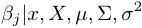
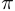
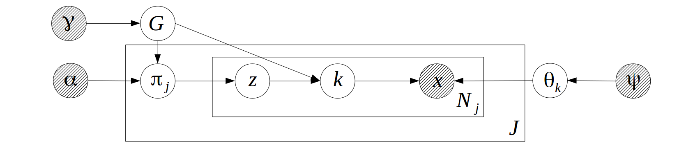
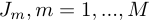

# bbricks 
 
[](https://travis-ci.com/chenhaotian/Bayesian-Bricks) [](https://cran.r-project.org/package=bbricks) [](https://cran.r-project.org/package=bbricks)
 
[bbricks](https://github.com/chenhaotian/Bayesian-Bricks) provides a collection of frequently used Bayesian parametric and nonparametric model *structures*, as well as a set of tools for common analytical *tasks*. 
 
+ *Structures* include linear Gaussian systems, Gaussian and Gaussian conjugate structure, Gaussian and Inverse-Wishart conjugate structure, Gaussian and Normal-Inverse-Wishart conjugate structure, Gaussian and Normal-Inverse-Gamma conjugate structure, Categorical and Dirichlet conjugate structure, Dirichlet Process on positive integers, Dirichlet Process in general, Hierarchical Dirichlet Process ... 
+ *Tasks* include updating posteriors, calculating marginal likelihood, calculating posterior predictive densities, sampling from posterior distribution, sampling from posterior predictive distribution, calculating MAP estimates ... 
 
See [Mindset](#mindset) for the idea behind **bbricks** and [Examples](#examples) to get started. 
 
**Note:** This is a package designed for statisticians, and the ones who want to learn the basic Bayesian mindsets. 
 
**----Installation----** 
 
```R
# install from CRAN:
install.packages("bbricks")
# or install development version from GitHub:
# install.packages("devtools") 
devtools::install_github("chenhaotian/Bayesian-Bricks") 
``` 
 
 
 
## Table of Contents 
 
[Installation](#bbricks) 
 
[Mindset](#Mindset) 
 
[Examples](#examples) 
 
+ [Hierarchical Bayesian Linear Regression](#hierarchical-bayesian-linear-regression) 
+ [Estimate Cancer Mortality Rates with Hierarchical Bayesian](#estimate-cancer-mortality-rates-with-hierarchical-bayesian) 
+ [Mixture of Gaussian](#mixture-of-gaussian) 
  + [Dirichlet Process Mixture Model](#dirichlet-process-mixture-model) 
  + [Mixture Model with Partially Observed Cluster Labels](#mixture-model-with-partially-observed-cluster-labels) 
+ [Hierarchical Mixture Models](#hierarchical-mixture-models) 
   
  + [Topic Modeling with HDP](#topic-modeling-with-hdp) 
+ [Hierarchical Mixture Models with Two Layers of Hierarchies](#hierarchical-mixture-models-with-two-layers-of-hierarchies) 
   
  + [Hierarchical Topic Modeling with HDP2](#hierarchical-topic-modeling-with-hdp2) 
   
+ [Bayesian Linear Regression](#bayesian-linear-regression) 
 
[3.References](#references) 
 
 
 
## Mindset 
 
The idea of **bbricks** came from the fact that modeling in Bayesian statistics is nothing more than applying a set of **tasks** on a specific **model structure**. 
 
Where the most frequently appeared **tasks** are: 

+ Update prior info into posterior when new samples are observed. 
+ Sample from the posterior distribution. 
+ Calculate marginal likelihood of the data set. 
+ Calculate posterior predictive densities from the posterior distribution. 
+ ... 
 
And the **model structure**s are always constituted by  basic Bayesian modeling structures: 
 
Where 
 
+  is the most basic "parameter-observation" structure. Models like Gaussian, Gamma and Exponential are in this category. 
+  is the "prior-posterior" structure. Models like Gaussian-NIW(Gaussian observations with NIW prior), Categorical-Dirichlet(Categorical observations with Dirichlet prior) are in this category. 
+  is the "hierarchical-Bayesian" structure, and  is the same hierarchical structure but with more hierarchies. Models like Hierarchical Dirichlet Process(HDP) and HDP with additional hidden layers are in this category. 
 
**bbricks** tries to provide a `type/class` for each basic **model structure** and a `function/method` for each **task**. 
 
See [Examples](#examples) for details. 
 
## Examples 
 
 
 
### Hierarchical Bayesian Linear Regression 
 
This is an example from Hoff(2009). Where we want to examine the relationship between math score and another variable, socioeconomic status (SES) of students from  different schools. The Conditional Probability Distributions (**CPD**s) of the model are defined as: 


 
 
Where  is the math score,  is a length  row vector  corresponding to each math score observation in , NIW is Normal-Inverse-Wishart distribution, it's density function is defined as: 


 
 
The graphical model structure for this model is: 
 
 
 
Where , . 
 
To enable sampling from this model, we first look at the CPDs of the random variables and their **Markov blanket**s: 
 
1. The Markov blanket for  is , the corresponding CPD of the blanket is a linear Gaussian system. **bbricks** provides an object of type `"LinearGaussianGaussian"` (see `?LinearGaussianGaussian` in R for details) to encode such a structure. 
2. The Markov blanket for  is , the corresponding CPDs of the blanket forms an Gaussian-NIW conjugate structure. **bbricks** provides an object of type `"GaussianNIW"` (see `?GaussianNIW` in R for details) to encode such a structure. 
3. The Markov blanket for  is , the corresponding CPDs of the blanket forms an Gaussian-InvWishart conjugate structure. **bbricks** provides an object of type `"GaussianInvWishart"` (see `?GaussianInvWishart` in R for details) to encode such a structure. 
 
Note that `"LinearGaussianGaussian"`, `"GaussianNIW"` and `"GaussianInvWishart"` are all basic prior-posterior structure as shown in [Mindset](#mindset) graph . In **bbricks**, all objects representing structures same as graph  are also of type `"BasicBayesian"`. For example a `"LinearGaussianGaussian"` object is also an `"BasicBayesian"` object. 
 
To estimate the posterior parameters ,  the Gibbs sampling procedure goes as: 
 
1. Sample  from a `LinearGaussianGaussian` object which encodes the distribution of . 
2. Sample  from a `GaussianNIW` object which encodes the distribution of  
3. Sample  from a `GaussianInvWishart` object which encodes the distribution of  
 
R code: 
 
```R 
## Gibbs sampling for hierarchical linear regression 
 
library(bbricks) 
## load some hierarchical linear regression data 
## hlrData is a list of 3 numeric vectors 
## see ?hlrData for details 
data(hlrData) 
x <- hlrData$mathScore                    #math score as the dependent variable 
X <- cbind(1,hlrData$socioeconomicStatus) #socioeconomic status as the independt variable 
js <- hlrData$schoolID                    #school ID as the group IDs. 
J <- max(js) 
## Initialization---------------------------------------------- 
## initialize the Markov blanket of mu and Sigma 
## the prior parameters are: m=0, k=0.0001, v=3, S=diag(1) 
objmS <- GaussianNIW(gamma = list(m =c(mean(hlrData$mathScore),0),k=0.0001,v=3,S=diag(2))) 
## initialize the Markov blanket of sigma^2 
## the prior parameters are: vs=2, Ss=diag(1) 
objs <- GaussianInvWishart(gamma = list(mu=0,v=2,S=diag(1))) 
## initialize mu and Sigma by sampling from the prior 
muSigma <- rPosterior(objmS) 
## initialize sigma^2 by sampling from the prior 
sigma2 <- rPosterior(objs) 
betaJ <- matrix(0,J,2)                  #place-holder the beta_j, j=1:J 
epsilon <- x                            #place-holder for the random noises 
## Main Gibbs loop--------------------------------------------- 
maxit <- 100                           #number of sampling iterations 
burnin <- 50                           #number of burn-in samples 
meanBeta <- betaJ                      #place-hoder for the sample means of beta 
it <- 1 
pb <- txtProgressBar(min = 0,max = maxit,style = 3) 
while(it<=maxit){ 
    ## Step1: sample beta_j, j in 1:100 
    for(j in 1L:J){ 
        objb <- LinearGaussianGaussian(gamma=list(Sigma=sigma2,m=muSigma$mu,S=muSigma$Sigma)) 
        idx <- js == j 
        ss <- sufficientStatistics(obj = objb,x=x[idx],A=X[idx,,drop=FALSE]) 
        posterior(obj = objb,ss = ss) 
        betaJ[j,] <- rPosterior(objb) 
    } 
    ## calculate the sample mean 
    if(it>burnin) meanBeta <- meanBeta+betaJ/(maxit-burnin) 
    ## Step2: sample mu and Sigma 
    ssmS <- sufficientStatistics(obj = objmS,x=betaJ) 
    posterior(obj = objmS,ss = ssmS) 
    muSigma <- rPosterior(obj = objmS) 
    ## Step3: sample sigma^2 
    for(j in 1L:J){ 
        idx <- js == j 
        epsilon[idx] <- x[idx]-X[idx,,drop=FALSE]%*%betaJ[j,] 
    } 
    sss <- sufficientStatistics(obj = objs,x=epsilon) 
    posterior(obj = objs,ss = sss) 
    sigma2 <- rPosterior(objs) 
    ## increase iteration counter  
    it <- it+1 
    setTxtProgressBar(pb,it) 
    ## if continue sampling, then discard the information in objmS and objs 
    ## to make room for the new information in the next iteration. 
    if(it < maxit){ 
        posteriorDiscard(obj = objmS,ss = ssmS) 
        posteriorDiscard(obj = objs,ss = sss) 
    } 
} 
## plot the result 
## gray lines are the betas of each school 
## black line is the beta for all the data as a whole 
plot(x=0, xlim = range(0.2,0.8),ylim = c(20,35),xlab = "socioeconomic status",ylab = "math score") 
for(j in 1L:J) 
    abline(a=betaJ[j,2],b=betaJ[j,1],col="gray") 
allSchools <- lm(x~X-1)$coefficients 
abline(a=allSchools[2],b=allSchools[1],lwd=3) 
 
``` 
 
 
 
### Estimate Cancer Mortality Rates with Hierarchical Bayesian 
 
This is an example from Johson and Albert(2006), where we want to estimate the cancer mortality rates of multiple cities with hierarchical Bayesian method. 
 
The model's graph structure is: 
 
 
 
Where  is a categorical random sample that takes one of two values: "death" or "no death". There are  cities in total,  are the mortality rates of the cities. 
 
The CPDs are: 


 
To enable sampling from this model, we first look at the CPDs of the random variables and their **Markov blanket**s: 
 
1. The Markov blanket for  is , the corresponding CPD of the blanket is a Categorical-Dirichlet conjugate structure. **bbricks** provides an object of type `"CatDirichlet"` (see `?CatDirichlet` in R for details) to encode such a structure. 
2. The Markov blanket for  is , the corresponding CPDs of the blanket is not very common thus not provided in **bbricks**, instead we can use Metropolis-Hastings algorithm to sample from it. 
 
Note that `"CatDirichlet"` is a basic prior-posterior structure as shown in [Mindset](#mindset) graph . In **bbricks**, all objects representing structures same as graph  are also of type `"BasicBayesian"`. For example a `"CatDirichlet"` object is also an `"BasicBayesian"` object. 
 
To estimate , we use the following Gibbs sampling procedure: 
 
1. sample  from a `CatDirichlet` object which encodes the distribution of  . 
2. sample  from the distribution of  with and independent Metropolis-Hastings algorithm. see `?MetropolisHastings` for details. 
 
R code: 
 
```R 
## Estimate cancer mortality rates using Gibbs sampling 
 
library(bbricks) 
 
## see ?cancerData for details 
data(cancerData) 
## Step1: Initialization---------------------------------------------- 
K <- length(cancerData)                          #then number of cities 
eta <- 1                                         #assume eta is known, eta=1 
## initialize alpha, PI, and sufficient statistics 
a <- rexp(2,rate = eta)                 #initialize alpha 
PI <- matrix(0,K,2L)                    #initialize pi 
cityPrior <- CatDirichlet(gamma = list(alpha=a,uniqueLabels=c("death","no death"))) 
citySS <- lapply(cancerData,function(x){sufficientStatistics(obj = cityPrior,x=x)}) #sufficient statistics of each city 
## initialize functions used in Metropolis-Hastings, see ?MetropolisHastings for details 
## density of the target distribution 
dp <- function(a){ 
    if(any(a<0)) -Inf 
    else sum(dDir(x=PI,alpha = a,LOG = TRUE))+sum(dexp(x=a,rate = eta,log = TRUE)) 
} 
## density of the proposal distribution 
dq <- function(anew,a){1}                #use a independent proposal 
## random sample generator of the proposal distribution 
rq <- function(x){ 
    c(runif(1,x[1]-1,x[1]+1), 
      runif(1,x[2]-1,x[2]+1)) 
} 
## Step2: main Gibbs sampling loop between alpha and pi -------------- 
maxit <- 1000 
burnin <- 500                            #number of burn-in samples 
meanPI <- numeric(K)                     #place-hoder for the sample mean 
it <- 1 
while(it<=maxit){ 
    ## Step1: sample pi from p(pi|a,x)------------- 
    for(k in 1L:K){ 
        posterior(obj = cityPrior,ss=citySS[[k]]) 
        PI[k,] <- rDir(n=1,alpha = cityPrior$gamma$alpha) 
        posteriorDiscard(obj = cityPrior,ss=citySS[[k]]) 
    } 
    ## calculate the sample mean 
    if(it>burnin) meanPI <- meanPI+PI[,1]/(maxit-burnin) 
    ## Step2: sample a from p(a|pi,g)-------------- 
    ## use Metropolis-Hastings 
    a <- MetropolisHastings(nsamples = 1,xini = a,dp=dp,dq=dq,rq=rq) 
    ## increase iteration counter  
    it <- it+1 
} 
## Step3: plot the result--------------------------------------------- 
## black bars are the sample mean from the hierarchical Bayesian model 
## blue bars are the MLE of the mortality rates. 
plot(1:K,meanPI,type = "h",xlab = "city",ylab = "mortality rate",lwd=3) 
lines(1:K+0.2,sapply(cancerData,function(l){sum(l=="death")/length(l)}),type = "h",col = "blue",lwd = 3) 
legend(1, 0.005, legend=c("Sample Mean", "MLE"),col=c("black", "blue"), lty=c(1,1), cex=1,lwd = 3) 
``` 
 
 
 
### Mixture of Gaussian 
 
A mixture of Gaussian has the following graph structure: 
 
 
 
Where there are  Gaussian components/groups.  is an Gaussian observation,  is the hidden group label,  is the component weights (or the group label distribution).  are the observation distribution parameters.  and  are prior parameters.  
 
The CPDs are: 


 
 
Where  is the Normal-Inverse-Wishart distribution with parameter .  is a numeric vector representing the "location parameter",  is a symmetric positive definitive matrix representing the "scale parameter",  and  are degree of freedoms. For a NIW sample , it's density function is defined as: 
 


 
 
A mixture model can be see as a combination of two "prior-posterior" structures(As shown in [Mindset](#mindset) graph ): One Categorical-Dirichlet structure  for the hidden cluster labels. and one Gaussian-NIW structure  for the observation distribution. 
 
In **bbricks** these two structures are initialized with a `"CatDirichlet"` object and a `"GaussianNIW"` object. To estimate  and , we use the following EM procedure: 
 
1. E-step: calculate  and the expected sufficient statistics and . 
2. M-step: Based on the expected sufficient statistics to get an MAP estimate of  and  
 
R code: 
 
```R 
## Get the MAP estimate of pi and theta using EM algorithm. 
 
library(bbricks) 
 
## load some mixture of Gaussian samples. 
## mmData is a numeric matrix with 2 columns, each row is a sample 
## see ?mmData for details 
data(mmData) 
K <- 4L                                 #number of clusters(mixtures components) 
z <- matrix(runif(nrow(mmData)*K),nrow(mmData),K) #the expected cluster label of each observation 
allK <- 1L:K    #temp variable, all component labels 
allZ <- rep(allK,each=nrow(mmData))     #temp variable, all possible cluster labels for all observations 
## z, pi and alpha are distributed as a Categorical-Dirichlet sturcture: 
mc <- CatDirichlet(gamma = list(alpha=0.5,uniqueLabels=allK)) # create a CatDirichlet object to track the posterior info, see ?CatDirichlet for details 
## each component distribution is a Gaussian-NIW structure: 
ec <- replicate(K,GaussianNIW(gamma = list(m=c(0,0),k=0.00001,v=2,S=diag(2)))) # create a GaussianNIW object to track the posterior info of each mixture component, see ?GaussianNIW for details 
mcMAP <- MAP(mc)                        #initialize the MAP estimate of pi 
ecMAP <- replicate(K,list(muMAP=runif(2),sigmaMAP=diag(2)),simplify = FALSE) #initialize the MAP estimate of theta 
## The main EM loop 
maxit <- 100                            #number of EM loops 
it <- 1 
while(it<=maxit){ 
    ## E-step--------------------------------------------------------- 
    ## calculate the expected cluster labels: p(z|pi,theta) 
    for(k in allK) z[,k] <- dGaussian(x=mmData,mu = ecMAP[[k]]$muMAP,Sigma=ecMAP[[k]]$sigmaMAP)+log(mcMAP[k]) 
    z <- exp(z-logsumexp(z))            #use logsumexp() to avoid numerical underflow 
    ## calculate the expected sufficient statistics 
    ssComponents <- lapply(allK,function(k){ 
        sufficientStatistics_Weighted(obj = ec[[k]],x=mmData,w=z[,k]) 
    })                                  #the expected sufficient statistics of each Gaussian component 
    ssPi <- sufficientStatistics_Weighted(obj = mc,x=allZ,w=as.vector(z)) #the expected sufficient statistics of the cluster label distribution 
    ## M-step--------------------------------------------------------- 
    ## use the sufficient statistics to update the prior distributions: 
    for(k in allK) posterior(obj = ec[[k]],ss=ssComponents[[k]]) #update component distributions 
    posterior(obj = mc,ss = ssPi)                                #update cluster label distribution 
    ## calculate the MAP estimates from posterior: 
    mcMAP <- MAP(mc) 
    ecMAP <- lapply(ec,MAP) 
    ## Reset the priors for next EM loop----------------------------------------- 
    ## to prepare for the next EM iteration, discard the sufficient statistics info from the posteriors: 
    for(k in allK) posteriorDiscard(obj = ec[[k]],ss=ssComponents[[k]]) 
    posteriorDiscard(obj = mc,ss = ssPi) 
    ## increase the iteration counter 
    it <- it+1 
} 
 
plot(mmData,col=apply(z,1,which.max)) #plot the best estimates 
mcMAP                                 #the MAP estimate of pi 
ecMAP                                 #the MAP estimate of theta_z 
``` 
 
 
 
#### Dirichlet Process Mixture Model 
 
The graph structure of Dirichlet Process Mixture Model(DP-MM) is exactly the same as a standard mixture model, except that the number of mixture components is not predetermined: 
 
 
 
The CPDs of a DP-MM is similar to the ones shown in [Mixture of Gaussian](#mixture-of-gaussian), the only difference is the distribution of  is a Dirichlet process rather than a Dirichlet distribution, for example if the observations are Gaussian distributed, the CPDs will be: 


 
Where  is a Dirichlet process on positive integers with "concentration parameter" , the "base measure", which is an uniform distribution on positive integers, is omitted from the formula.   is the Normal-Inverse-Wishart distribution with parameter .  is a numeric vector representing the "location parameter",  is a symmetric positive definitive matrix representing the "scale parameter",  and  are degree of freedoms. 
 
A DP-MM can be see as a combination of two "prior-posterior" structures(As shown in [Mindset](#mindset) graph ): One Categorical-DirichletProcess structure for the hidden cluster label distribution , which we call it a "DP on positive integers". And one structure for the observation distribution . 
 
In **bbricks**, "DP on positive integers" is represented by an object of type `"CatDP"`. 
 
To further simplify the calculations, **bbricks** also provides an `"DP"` type to represent all Dirichlet process structures. An object of type  `"DP"` is in essence a combination of a `"CatDP"` object, which encodes the  structure, i.e. a Dirichlet process on positive integers, and an arbitrary `"BasicBayesian"` object, which encodes the  structure. (in **bbricks**, all models with same structure as [Mindset](#mindset) graph  are `"BasicBayesian" `s, such as `"GaussianNIW"`, `"GaussianNIG"`, `"CatDirichlet"` and even `"CatDP"`) . 
 
To estimate , we use the following collapse Gibbs sampling procedure: 
 
1. sample  from . 
 
R code: 
 
```R 
## Sample cluster labels z from DP-MM using Gibbs sampling 
 
library(bbricks) 
 
## load some mixture of Gaussian samples. 
## mmData is a numeric matrix with 2 columns, each row is a sample 
## see ?mmData for details 
data(mmData) 
maxit <- 100                            #number of total samples 
burnin <- 50                            #number of burnin samples 
## Step1: Initialization ----------------------------------------- 
obj <- DP(gamma = list(alpha=10,H0aF="GaussianNIW",parH0=list(m=c(0,0),k=0.001,v=2,S=diag(2)))) #create a DP object to track all the changes, the DP object in this case is a combination of a CatDP object and a GaussianNIW object 
z <- matrix(1L,nrow(mmData),maxit-burnin)    #place-holder for the sampled z 
ss <- sufficientStatistics(obj,x=mmData,foreach = TRUE) #sufficient statistics of each observed sample 
N <- nrow(mmData) 
for(i in 1L:N){ # initialize labels before Gibbs sampling 
    z[i,1] <- rPosteriorPredictive(obj = obj,n=1,x=mmData[i,,drop=FALSE]) 
    posterior(obj = obj,ss = ss[[i]], z = z[i,1]) 
} 
## Step2: Main Gibbs sampling loop-------------------------------- 
it <- 1                                 #iteration tracker 
pb <- txtProgressBar(min = 0,max = maxit,style = 3) 
while(it<=maxit){ 
    if(it>burnin) colIdx <- it-burnin 
    else colIdx <- 1 
    for(i in 1L:N){ 
        ## remove the sample information from the posterior 
        posteriorDiscard(obj = obj,ss = ss[[i]],z=z[i,colIdx]) 
        ## get a new sample 
        z[i,colIdx] <- rPosteriorPredictive(obj = obj,n=1,x=mmData[i,,drop=FALSE]) 
        ## add the new sample information to the posterior 
        posterior(obj = obj,ss = ss[[i]],z=z[i,colIdx]) 
    } 
    if(it>burnin & colIdx<ncol(z)) z[,colIdx+1] <- z[,colIdx] #copy result of previous iteration 
    it <- it+1 
    setTxtProgressBar(pb,it) 
    if(it>=maxit){cat("\n");break} 
    plot(x=mmData[,1],y=mmData[,2],col=z[,colIdx]) #to see how the labels change in each iteration 
} 
## Step3: Estimate group labels of each observation--------------- 
## pick the most frequent z as the best estimate 
zBest <- apply(z,1,function(l){ 
    tmp <- table(l) 
    names(tmp)[which.max(tmp)] 
}) 
plot(x=mmData[,1],y=mmData[,2],col=zBest) 
``` 
 
 
 
#### Mixture Model with Partially Observed Cluster Labels 
 
In the dataset `mmData` of the previous example, what if we know the 50, 100, 150 and 200th samples belong to 4 different clusters(they are shown as different color and shapes in the graph below), how should we incorporate this information in the model? 
 
 
 
With DP-MM, one only need to **1.** update the DP prior (as defined in previous R example) with the information of the 4 observed samples, and **2.** use the updated prior as the prior of the Gibbs sampling procedure.  These 2 steps can be achieved by adding following code after `obj <- DP(...)` in the previous R example: 
 
```R 
## 1. add the information of the 4 observed samples to the DP object 
ssObserved <- sufficientStatistics(obj=obj,x=mmData[c(50,100,150,200),,drop=FALSE],foreach = TRUE) 
for(i in 1L:4L) posterior(obj = obj,ss = ssObserved[[i]], z = i) # the choice of cluster label 'z' for the 4 observed samples are arbitrary, as long as they are different from each other. In this example I simply use z=1L:4L. 
## 2. remove the 4 samples from the upcoming Gibbs sampling procedure 
mmData <- mmData[-c(50,100,150,200),] 
``` 
 
Run the code, and the result will be: 
 
 
 
 
 
### Hierarchical Mixture Models 
 
In a hierarchical mixture model, the observation  are generated by some unknown mixture components and are split into  groups, all  groups share the same set of mixture components but with different mixture weights. 
 
Hierarchical Dirichlet Process(HDP) is a natural representation of a hierarchical mixture model, It has following graph structure: 
 
 
 
If the component distribution is Gaussian, the CPDs will be: 


 
Where  is a Dirichlet process on positive integers with "concentration parameter" , the "base measure", which is an uniform distribution on positive integers, is omitted from the formula.   is a Dirichlet process with concentration parameter  and base measure .  is the Normal-Inverse-Wishart distribution with parameter .  is a numeric vector representing the "location parameter",  is a symmetric positive definitive matrix representing the "scale parameter",  and  are degree of freedoms. 
 
The distribution of  is a "HDP on positive integers". HDP on positive integers are usually represented in a much simpler and compact way(though not easier to understand) in most literature: 
 
 
 
From the compact representation we can see that HDP on positive integers is following the "Hierarchical Bayesian" structure shown in [Mindset](#mindset) graph . In **bbricks**, "HDP on positive integers" is represented by an object of type `"CatHDP"`. 
 
To simplify the mixture model calculations, **bbricks** alos provides an `"HDP"` type to represent more general hierarchical Dirichlet process models. An object of type  `"HDP"` is in essence a combination of a `"CatHDP"` object, which encodes the distribution of , i.e. a HDP on positive integers; and an arbitrary `"BasicBayesian"` object, which encodes the  structure. (in **bbricks**, all models with same structure as [Mindset](#mindset) graph  are `"BasicBayesian" `s, such as `"GaussianNIW"`, `"GaussianNIG"` ,`"CatDirichlet"` and even `"CatDP"`)  
 
To estimate , we use the following Gibbs sampling procedure: 
 
1. sample  from . 
 
R code: 
 
```R 
## Sample cluster labels k from HDP-MM using Gibbs sampling 
 
library(bbricks) 
 
## load some mixture of Gaussian samples. 
## mmhData is a list of two elements. mmhData$x is a matrix of Gaussian observations, each row is an observation; mmhData$groupLabel is the group label of each observation. 
## see ?mmhData for details 
data(mmhData) 
x <- mmhData$x 
js <- mmhData$groupLabel 
## Step1: Initialization------------------------------------------ 
maxit <- 50                             #iterative for maxit times 
burnin <- 30                            #number of burn in samples 
## create a HDP object to track all the changes, the HDP object in this case is a combination of a CatHDP object and a GaussianNIW object: 
obj <- HDP(gamma = list(gamma=1,j=max(js),alpha=1, 
                        H0aF="GaussianNIW", 
                        parH0=list(m=c(0,0),k=0.001,v=2,S=diag(2)*0.01))) 
ss <- sufficientStatistics(obj$H,x=x,foreach = TRUE) #sufficient statistics 
set.seed(1) 
z <- rep(1L,nrow(x)) 
k <- matrix(1L,nrow(x),maxit-burnin)    #place-holder for the sampled k 
N <- length(ss) 
for(i in 1L:N){# initialize k and z 
    tmp <- rPosteriorPredictive(obj = obj,n=1,x=x[i,,drop=FALSE],j=js[i]) 
    z[i] <- tmp["z"] 
    k[i,1] <- tmp["k"] 
    posterior.HDP(obj = obj,ss = ss[[i]],ss1 = k[i],ss2 = z[i],j = js[i]) 
} 
## Step2: main Gibbs loop--------------------------------------------- 
it <- 1                                 #iteration tracker 
pb <- txtProgressBar(min = 0,max = maxit,style = 3) 
while(it<=maxit){ 
    if(it>burnin) colIdx <- it-burnin 
    else colIdx <- 1 
    for(i in 1L:N){ 
        ## remove the sample from the posterior info 
        posteriorDiscard(obj = obj,ss = ss[[i]],ss1=k[i,colIdx],ss2=z[i],j=js[i]) 
        ## resample a new partition 
        tmp <- rPosteriorPredictive(obj = obj,n=1,x=x[i,,drop=FALSE],j=js[i]) 
        z[i] <- tmp["z"] 
        k[i,colIdx] <- tmp["k"] 
        ## add the information of the new sample 
        posterior(obj = obj,ss = ss[[i]], ss1=k[i,colIdx],ss2 = z[i],j=js[i]) 
    } 
    if(it>burnin & colIdx<ncol(k)) k[,colIdx+1] <- k[,colIdx] #copy result of previous iteration 
    it <- it+1 
    plot(x=x[,1],y=x[,2],col=k[,colIdx])         #to visualize the group label dynamics 
    setTxtProgressBar(pb,it) 
} 
## Step3: Estimate group labels of each observation--------------- 
## pick the most frequent k as the best estimate 
kBest <- apply(k,1,function(l){ 
    tmp <- table(l) 
    names(tmp)[which.max(tmp)] 
}) 
plot(x=x[,1],y=x[,2],col=kBest) 
``` 
 
 
 
#### Topic Modeling with HDP 
 
A topic model is a hierarchical mixture model(See [Hierarchical Mixture Models](#hierarchical-mixture-models)) with categorical component distribution: 


 
The Gibbs sampling procedure on this model is exactly the same as the one in [Hierarchical Mixture Models](#hierarchical-mixture-models) 
 
R code: 
 
```R 
## HDP-LDA on the farm-ads corpus 
 
## load a subset of farm ads data from https://archive.ics.uci.edu/ml/datasets/Farm+Ads 
## see ?farmadsData for details 
data(farmadsData) 
word <- farmadsData$word 
document <- farmadsData$document 
## Step1: Initialization------------------------------------------ 
set.seed(1) 
maxit <- 30                            #iterative for maxit times 
z <- rep(1L,length(word)) 
k <- rep(1L,length(word)) 
## initialize 
uniqueWords <- unique(word) 
obj <- HDP(gamma = list(gamma=1,j=max(document),alpha=1,H0aF="CatDirichlet",parH0=list(alpha=rep(0.5,length(uniqueWords)),uniqueLabels=uniqueWords))) #create a HDP object to track all the changes, the HDP object in this case is a combination of a CatHDP object and a CatDrirchlet object 
N <- length(word) 
## initialize k and z 
for(i in 1L:N){ 
    tmp <- rPosteriorPredictive(obj = obj,n=1,x=word[i],j=document[i]) 
    z[i] <- tmp["z"] 
    k[i] <- tmp["k"] 
    posterior(obj = obj,ss = word[i], ss2 = z[i],j=document[i],ss1=k[i]) 
} 
## Step2: main Gibbs loop--------------------------------------------- 
it <- 1                                 #iteration tracker 
pb <- txtProgressBar(min = 0,max = maxit,style = 3) 
while(it<=maxit){ 
    for(i in 1L:N){ 
        posteriorDiscard.HDP(obj = obj,ss = word[i],ss1=k[i],ss2=z[i],j=document[i]) #remove the sample information from the posterior 
        tmp <- rPosteriorPredictive(obj = obj,n=1,x=word[i],j=document[i])   #get a new sample 
        z[i] <- tmp["z"] 
        k[i] <- tmp["k"] 
        posterior(obj = obj,ss = word[i],ss1=k[i], ss2 = z[i],j=document[i]) #add the new sample information to the posterior 
    } 
    it <- it+1 
    setTxtProgressBar(pb,it) 
} 
## Step3: plot the result -------------------------------------------- 
## see which topics are most frequently appeared: 
order(sapply(obj$X,function(l){sum(l$gamma$alpha)}),decreasing = TRUE) 
## seems topic 2 and 1 appear the most, let's plot them: 
## install.packages("wordcloud") # for word-cloud 
## install.packages("RColorBrewer") # color palettes 
## print topic 1 
wordcloud:: wordcloud(words = obj$X[[1]]$gamma$uniqueLabels, 
                      freq = obj$X[[1]]$gamma$alpha, 
                      min.freq = 1, 
                      max.words=100, 
                      random.order=FALSE, rot.per=0.35, 
                      colors=RColorBrewer::brewer.pal(5, "Set1")) 
## print topic 2 
wordcloud:: wordcloud(words = obj$X[[2]]$gamma$uniqueLabels, 
                      freq = obj$X[[2]]$gamma$alpha, 
                      min.freq = 1, 
                      max.words=100, 
                      random.order=FALSE, rot.per=0.35, 
                      colors=RColorBrewer::brewer.pal(5, "Set1")) 
``` 
 
### Hierarchical Mixture Models with Two Layers of Hierarchies 
 
By extending the [Hierarchical Mixture Models](#hierarchical-mixture-models) with an additional layer of Dirichlet process on top, the model is then able to capture longer-term and cross-group dependencies. 
In this hierarchical mixture model, the observation  are generated by some unknown mixture components and are split into  groups, each group has  sub-groups. All  groups share the same set of mixture components but with different mixture weights, all  sub-groups within each group  also share the same set of mixture components but different mixture weights. The graphical model structure is: 
 
If the component distribution is Gaussian, the CPDs will be: 


 
 
Where  is a Dirichlet process on positive integers with "concentration parameter" , the "base measure", which is an uniform distribution on positive integers, is omitted from the formula.  is a Dirichlet process with concentration parameter  and base measure .  is a Dirichlet process with concentration parameter  and base measure .  is the Normal-Inverse-Wishart distribution with parameter .  is a numeric vector representing the "location parameter",  is a symmetric positive definitive matrix representing the "scale parameter",  and  are degree of freedoms. 
 
The distribution of  is a "HDP on positive integers with two layers of hierarchies". Like the `"CatHDP"` object mentioned in  [Hierarchical Mixture Models](#hierarchical-mixture-models), **bbricks** use a `"CatHDP2"` object to represent a "HDP on positive integers with two layers of hierarchies". 
 
To simplify the mixture model calculations, **bbricks** also provides an `"HDP2"` type to represent all hierarchical Dirichlet process with two layers of hierarchies. An object of type  `"HDP2"` is in essence a combination of a `"CatHDP2"` object, which encodes the distribution of , i.e. a HDP on positive integers with two layers of hierarchies; and an arbitrary `"BasicBayesian"` object, which encodes the  structure. (in **bbricks**, all models with same structure as [Mindset](#mindset) graph  are `"BasicBayesian" `s, such as `"GaussianNIW"`, `"GaussianNIG"`, `"CatDirichlet"` and even `"CatDP"`)   
 
To estimate , we use the following Gibbs sampling procedure: 
 
1. sample  from . 
 
R code: 
 
```R 
## Sample cluster labels u from HDP2-MM using Gibbs sampling 
 
library(bbricks) 
 
## load some mixture of Gaussian samples. 
## mmhData is a list of 3 elements. mmhhData$x is a matrix of Gaussian observations, each row is an observation; mmhhData$groupLabel is the group label of each observation. mmhhData$subGroupLabel is the subgroup label of each observation. 
## there are 2 groups, group1 has 10 subgroups, group has 20 subgroups. 
## see ?mmhhData for details 
data(mmhhData) 
x <- mmhhData$x 
groupLabel <- mmhhData$groupLabel 
subGroupLabel <- mmhhData$subGroupLabel 
## Step1: Initialization------------------------------------------ 
maxit <- 50                            #iterative for maxit times 
burnin <- 20                           #number of burn in samples 
## create a HDP2 object to track all the changes, the HDP2 object in this case is a combination of a CatHDP2 object and a GaussianNIW object 
obj <- HDP2(gamma = list(eta=1,gamma=1,alpha=1,m=2L,j=c(10L,20L),H0aF="GaussianNIW",parH0=list(m=c(0,0),k=0.001,v=1.1,S=diag(2)*0.001))) 
ss <- sufficientStatistics(obj$H,x=x,foreach = TRUE) #sufficient statistics 
z <- rep(1L,nrow(x)) 
k <- rep(1L,nrow(x)) 
u <- matrix(1L,nrow(x),maxit-burnin) 
N <- length(ss) 
## initialization k, z and u 
for(i in 1L:N){ 
    tmp <- rPosteriorPredictive(obj = obj,n=1,x=x[i,,drop=FALSE],m=groupLabel[i],j=subGroupLabel[i]) 
    z[i] <- tmp["z"] 
    k[i] <- tmp["k"] 
    u[i,1] <- tmp["u"] 
    posterior.HDP2(obj = obj,ss = ss[[i]],ss1 = u[i,1],ss2 = k[i],ss3 = z[i],m=groupLabel[i],j = subGroupLabel[i]) 
} 
## Step2: main Gibbs loop--------------------------------------------- 
it <- 1                                 #iteration counter 
pb <- txtProgressBar(min = 0,max = maxit,style = 3) 
while(it<=maxit){ 
    if(it>burnin) colIdx <- it-burnin 
    else colIdx <- 1 
    for(i in 1L:N){ 
        ## remove the sample from the posterior info 
        posteriorDiscard(obj = obj,ss = ss[[i]],ss1=u[i,colIdx],ss2=k[i],ss3 = z[i],m=groupLabel[i],j=subGroupLabel[i]) 
        ## resample a new partition 
        tmp <- rPosteriorPredictive(obj = obj,n=1L,x=x[i,,drop=FALSE],m=groupLabel[i],j=subGroupLabel[i]) 
        z[i] <- tmp["z"] 
        k[i] <- tmp["k"] 
        u[i,colIdx] <- tmp["u"] 
        ## add the information of the new sample 
        posterior(obj = obj,ss = ss[[i]], ss1=u[i,colIdx],ss2 = k[i],ss3 = z[i],m=groupLabel[i],j=subGroupLabel[i]) 
    } 
    if(it>burnin & colIdx<ncol(u)) u[,colIdx+1] <- u[,colIdx] #copy result of previous iteration 
    it <- it+1 
    plot(x=x[,1],y=x[,2],col=u[,colIdx]) 
    setTxtProgressBar(pb,it) 
} 
## Step3: Estimate group labels of each observation--------------- 
## pick the most frequent u as the best estimate 
uBest <- apply(u,1,function(l){ 
    tmp <- table(l) 
    names(tmp)[which.max(tmp)] 
}) 
plot(x=x[,1],y=x[,2],col=uBest) 
``` 
 
 
 
#### Hierarchical Topic Modeling with HDP2 
 
If we want to extract topics from multiple corpus, and we want the corpus to share the same set of topics, this is a model called the "hierarchical topic model"(Griffiths, Thomas L., et al. "Hierarchical topic models and the nested Chinese restaurant process." *Advances in neural information processing systems*. 2004.). A hierarchical topic model is a [Hierarchical Mixture Models with Two Layers of Hierarchies](#hierarchical-mixture-models-with-two-layers-of-hierarchies). The model can be built by simply replacing the `"GaussianNIW"` object with a `"CatDirichlet"` object in the previous R example. 
 
### Bayesian Linear Regression 
 
A Bayesian linear regression model has the following graph structure: 
 
 
 
The CPDs are: 


 
Since the combination of "Gaussian" and "InvGamma" is a commonly used conjugate structure in Bayesian linear regression, people named the combination as "Normal-Inverse-Gamma" (NIG) distribution. With NIG, the CPDs are usually represented as: 


 
Where  is the Normal-Inverse-Gamma distribution with parameter ,  and  are the "location" and "scale" parameters,  and  are the "shape" and "rate" parameters. 
 
The distribution of  is a basic prior-posterior structure as shown in [Mindset](#mindset) graph . **bbricks** provides an object of type `"GaussianNIG"` to represent such a structure.  
 
See the R example below for applying MAP estimate, posterior predictive, and marginal likelihood calculations on the `"GaussianNIG"` object: 
 
```R 
## Bayesian linear regression 
 
library(bbricks) 
 
## lrData is a list of two elements. lrData$x is the sample set of the dependent variable; lrData$X is the sample set of the independent variable 
## see ?lrData for details 
data(lrData) 
X <- lrData$X                           #a matrix of 1 column 
x <- lrData$x                           #a numeric vector 
## task 1. update the prior into posterior using X and x 
obj <- GaussianNIG(gamma=list(m=0,V=1,a=1,b=0)) #create a GaussianNIG object 
ss <- sufficientStatistics(obj = obj,X=X,x=x)   #the sufficient statistics of X and x 
posterior(obj = obj,ss = ss)                    #add the infomation to the posterior 
## task 2. get MAP estimate of beta and sigma^2 from the posterior 
bsMAP <- MAP(obj)                               #get the MAP estimate of beta and sigma^2 
bsMAP                                           #print the MAP estimate 
## plot the MAP estimate of the regression line 
plot(X,X%*%bsMAP$betaMAP,type = "l") 
points(X,x,pch=20) 
## task 3. calculate marginal likelihood 
## generate some new data 
Xnew <- matrix(runif(3,min=0,max=),ncol=1) 
xnew <- Xnew*0.2+rnorm(3,sd=10) 
marginalLikelihood(obj = obj,X=x,x=x,LOG = TRUE) 
## task 4. calculate the posterior prediction 
## say we want to predict x at the location X=100 
predictedSamples <- rPosteriorPredictive(obj = obj,X=matrix(101,ncol = 1),n=1000) 
## histogram of the prediction 
hist(predictedSamples) 
## the mean and standard devition of the prediction 
mean(predictedSamples) 
sd(predictedSamples) 
 
``` 
 
 
 
## References 
 
Andrieu, Christophe, et al. "An introduction to MCMC for machine learning." *Machine learning* 50.1-2 (2003): 5-43. 
 
Johnson, Valen E., and James H. Albert. *Ordinal data modeling*. Springer Science & Business Media, 2006. 
 
Hoff, Peter D. *A first course in Bayesian statistical methods*. Vol. 580. New York: Springer, 2009. 
 
Li, Yuelin, Elizabeth Schofield, and Mithat Gönen. "A tutorial on Dirichlet process mixture modeling." *Journal of Mathematical Psychology* 91 (2019): 128-144. 
 
MARolA, K. V., JT KBNT, and J. M. Bibly. Multivariate analysis. AcadeInic Press, Londres, 1979. 
 
McLachlan, Geoffrey J., and Thriyambakam Krishnan. *The EM algorithm and extensions*. Vol. 382. John Wiley & Sons, 2007. 
 
Murphy, Kevin P. *Machine learning: a probabilistic perspective*. MIT press, 2012. 
 
Smith, W. B., and R. R. Hocking. *Algorithm as 53: Wishart variate generator.* Journal of the Royal Statistical Society. Series C (Applied Statistics) 21.3 (1972): 341-345. 
 
Teh, Yee Whye. "Dirichlet Process." (2010): 280-287. 
 
Teh, Yee W., et al. "Sharing clusters among related groups: Hierarchical Dirichlet processes." *Advances in neural information processing systems*. 2005. 
 
Wishart, John. "The generalized product moment distribution in samples from a normal multivariate population." Biometrika (1928): 32-52. 
 

