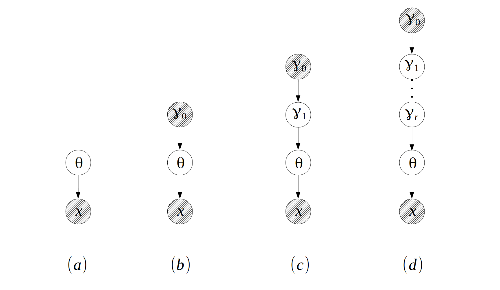

# bbricks

[](https://travis-ci.com/chenhaotian/Bayesian-Bricks)

**bbricks** provides a collection of inference tools and conditoinal probability distributions(CPDs) to facilitate Bayesian network modeling. This is a package designed for **statisticians, and the ones who want to learn the basic statistical mindsets**.

See [Mindset](#mindset) and [Examples](#examples) to get started.


## Installation

```R
# install development version from GitHub:
# install.packages("devtools")
devtools::install_github("chenhaotian/Bayesian-Bricks")
```


## Mindset

The idea of **bbricks** came from the fact that Bayesian modeling is nothing more than applying set of **tasks** on a specific **model structure**.

Where the most frequently appeared **tasks** are:
+ Update prior info into posterior when new samples are observed.
+ Sample from the posterior distribution.
+ Calculate marginal likelihood of the posterior distribution.
+ Calculate posterior predictive of the posterior distribution.
+ ...

And the **model structure**s are just generalizations of $3$ basic Bayesian modeling structures:

Where
+ $(a)$ is the most basic "parameter-observation" structure. Models like Gaussian, Gamma and Exponential are in this category.
+ $(b)$ is the "prior-posterior" structure. Models like Gaussian-NIW(Gaussian observations with NIW prior), Categorical-Dirichlet(Categorical observations with Dirichlet prior) are in this category.
+ $(c)$ is the "hierarchical-Bayesian" structure, and $(d)$ is the same hierarchical structure but with more hierarchies. Models like Hierarchical Dirichlet Process(HDP) and HDP with additional hidden layers are in this category.

**bbricks** tries to provide a `type/class` for each basic **model structure** and a `function/method` for each **task**.

See below for details.


## Examples

+ [Mixture Models](#mixture-models)
  + [Mixture of Gaussian](#mixture-of-gaussian)
  + [Dirichlet Process Mixture Model](#dirichlet-process-mixture-model)
  + [Mixture Model with Partially Observed Samples](#mixture-model-with-partially-observed-samples)
+ [Hierarchical Mixture Models](#hierarchical-mixture-models)
  + [Topic Modeling with HDP](topic-modeling-with-hdp)
  + [Hierarchical Topic Modeling with HDP2](hierarchical-topic-modeling-with-hdp2)
+ [Infinite State Hidden Markov Model](#infinite-state-hidden-markov-model)
+ [Bayesian Linear Regression](#bayesian-linear-regression)
+ [Esitmate Cancer Motality Rates](esitmate-cancer-motality-rates)


### Mixture Models


#### Mixture of Gaussian

#### Dirichlet Process Mixture Model

#### Mixture Model with Partially Observed Samples


### Hierarchical Mixture Models

#### Topic Modeling with HDP

#### Hierarchical Topic Modeling with HDP2
  
A Gaussian mixture model is a combination of two "prior-posterior" structures. One Categorical-Dirichlet for the hidden class label distribution, one Gaussian-NIW for the observation distribution.


### Examples

+ [Introduction](#introduction)
  + [The Model](#the-model)
  + [The Inference Problems](#the-inference-problems)
+ [Usage](#usage)
+ [Reference](#reference)


```R
## -------------------------------------------------------------
## Mixture of Gaussian EM
## -------------------------------------------------------------


library(bbricks)

logsumexp <- function(X){
    X <- as.matrix(X)
    a <- apply(X,1,max)
    log(rowSums(exp(X-a)))+a
}

## load some mixture of Gaussian samples.
## see ?mmData for details
data(mmData)
x <- mmData                             #a numeric matrix with 2 columns, each row is a sample

K <- 4L                                 #number of mixture components
z <- matrix(runif(nrow(x)*K),nrow(x),K) #for book-keeping

## temp variable, all component labels
allK <- 1L:K
## temp variable, all possible class labels for each observation
allZ <- rep(allK,each=nrow(x))

## initialization-------------------------------------------------
## mixture component is distributed as a Categorical-Dirichlet sturcture:
mc <- CatDirichlet(gamma = list(alpha=0.5,uniqueLabels=allK))
mcMAP <- MAP(mc)
## each component distribution is a Gaussian-NIW structure:
ec <- replicate(K,GaussianNIW(gamma = list(m=c(0,0),
                                           k=0.00001,
                                           v=2,
                                           S=diag(2)
                                           )))
ecMAP <- replicate(K,list(muMAP=runif(2),sigmaMAP=diag(2)),simplify = FALSE)


maxit <- 100

it <- 1
LL <- numeric(maxit)
while(it<=maxit){
    ## E-step---------------------------------------------------------
    for(k in allK) z[,k] <- dGaussian(x=x,mu = ecMAP[[k]]$muMAP,Sigma=ecMAP[[k]]$sigmaMAP)+log(mcMAP[k])
    z <- exp(z-logsumexp(z))
    ## M-step---------------------------------------------------------
    ## get the weighted sufficient statistics
    ssComponents <- lapply(allK,function(k){
        sufficientStatistics_Weighted(obj = ec[[k]],x=x,w=z[,k])
    })
    ssPi <- sufficientStatistics_Weighted(obj = mc,x=allZ,w=as.vector(z))
    ## use the sufficient statistics to update the prior distributions:
    for(k in allK) posterior(obj = ec[[k]],ss=ssComponents[[k]])
    posterior(obj = mc,ss = sspi)
    ## get MAP from posterior
    mcMAP <- MAP(mc)
    ecMAP <- lapply(ec,MAP)
    ## remove sufficient statistics from posterior, prepare for next iteration:
    for(k in allK) posteriorDiscard(obj = ec[[k]],ss=ssComponents[[k]])
    posteriorDiscard(obj = mc,ss = sspi)
    ## increase iteration counter
    it <- it+1
}

plot(x,col=apply(z,1,which.max))

## -------------------------------------------------------------
## Mixture of Gaussian DP
## -------------------------------------------------------------


library(bbricks)

## load some mixture of Gaussian samples.
## see ?mmData for details
data(mmData)
## x is a numeric matrix with 2 columns
x <- mmData

## Step1: Initialize----------------------------------------------
maxit <- 100                            #iterative for maxit times
burnin <- 50                            #number of burnin samples
z <- matrix(1L,nrow(x),maxit-burnin)    #labels
## create an "GaussianNIW" object to track all the changes.
obj <- DP(gamma = list(alpha=10,H0aF="GaussianNIW",parH0=list(m=c(0,0),k=0.001,v=2,S=diag(2))))
ss <- sufficientStatistics(obj,x=x,foreach = TRUE) #sufficient statistics of each x
N <- nrow(x)
for(i in 1L:N){ # initialize labels before Gibbs sampling
    z[i,1] <- rPosteriorPredictive(obj = obj,n=1,x=x[i,,drop=FALSE])
    posterior(obj = obj,ss = ss[[i]], z = z[i,1])
}

## Step2: Main Gibbs sampling loop--------------------------------
it <- 0                                 #iteration tracker
pb <- txtProgressBar(min = 0,max = maxit,style = 3)
while(TRUE){
    if(it>burnin) colIdx <- it-burnin
    else colIdx <- 1
    for(i in 1L:N){
        ## remove the sample information from the posterior
        posteriorDiscard(obj = obj,ss = ss[[i]],z=z[i,colIdx])
        ## get a new sample
        z[i,colIdx] <- rPosteriorPredictive(obj = obj,n=1,x=x[i,,drop=FALSE])
        ## add the new sample information to the posterior
        posterior(obj = obj,ss = ss[[i]],z=z[i,colIdx])
    }
    if(it>burnin & colIdx<ncol(z)) z[,colIdx+1] <- z[,colIdx] #copy result of previous iteration
    it <- it+1
    setTxtProgressBar(pb,it)
    if(it>=maxit){cat("\n");break}
    plot(x=x[,1],y=x[,2],col=z[,colIdx]) #to see how the labels change
}

## Step3: Estimate group labels of each observation---------------
col <- apply(z,1,function(l){
    tmp <- table(l)
    ## pick the most frequent group label in the samples to be the best estimate
    names(tmp)[which.max(tmp)]
})
plot(x=x[,1],y=x[,2],col=col)


## -------------------------------------------------------------
## Bayesian Linear Regression
## -------------------------------------------------------------

library(bbricks)

data(lrData)

X <- lrData$X                           #a matrix of 1 column
x <- lrData$x                           #a numeric vector

obj <- GaussianNIG(gamma=list(m=0,V=1,a=1,b=0)) #create a GaussianNIG object
ss <- sufficientStatistics(obj = obj,X=X,x=x)   #the sufficient statistics of X and x
posterior(obj = obj,ss = ss)                    #add the infomation to the posterior
bsMAP <- MAP(obj)                                        #get the MAP estimate of beta and sigma^2
## print the whole content, "invV" and "mVm" in the output are temporary variables.
obj
## plot the MAP estimate of the regression line
plot(X,X%*%bsMAP$betaMAP,type = "l")
points(X,x,pch=20)


## -------------------------------------------------------------
## Hierarchical Mixture Models
## -------------------------------------------------------------

## This is an example of Gibbs sampling on an hierarchical mixture model, using HDP.

## load some hierarchical mixture data, check ?mmhData for details.
data(mmhData)
x <- mmhData$x
js <- mmhData$groupLabel


## Step1: initialize--------------------------------------------------
z <- rep(1L,nrow(x))
k <- rep(1L,nrow(x))
## create a HDP object to track all the changes
obj <- HDP(gamma = list(gamma=1,j=max(js),alpha=1,
                        H0aF="GaussianNIW",
                        parH0=list(m=c(0,0),k=0.001,v=2,S=diag(2)*0.01)))
ss <- sufficientStatistics(obj$H,x=x,foreach = TRUE) #sufficient statistics
N <- length(ss)
for(i in 1L:N){# initialize k and z
    tmp <- rPosteriorPredictive(obj = obj,n=1,x=x[i,,drop=FALSE],j=js[i])
    z[i] <- tmp["z"]
    k[i] <- tmp["k"]
    posterior.HDP(obj = obj,ss = ss[[i]],ss1 = k[i],ss2 = z[i],j = js[i])
}

## Step2: main Gibbs loop---------------------------------------------
maxit <- 20                             #iterative for maxit times
it <- 0                                 #iteration tracker
pb <- txtProgressBar(min = 0,max = maxit,style = 3)
while(TRUE){
    for(i in 1L:N){
        ## remove the sample from the posterior info
        posteriorDiscard(obj = obj,ss = ss[[i]],ss1=k[i],ss2=z[i],j=js[i])
        ## resample a new partition
        tmp <- rPosteriorPredictive(obj = obj,n=1,x=x[i,,drop=FALSE],j=js[i])
        z[i] <- tmp["z"]
        k[i] <- tmp["k"]
        posterior(obj = obj,ss = ss[[i]], ss1=k[i],ss2 = z[i],j=js[i])
    }
    plot(x=x[,1],y=x[,2],col=k)         #to visualize the group label dynamics
    it <- it+1
    setTxtProgressBar(pb,it)
    if(it>=maxit){cat("\n");break}
}
## End(Not run)

```

