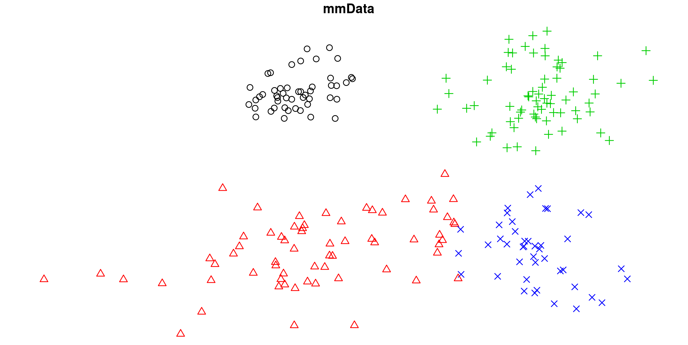

# bbricks

[](https://travis-ci.com/chenhaotian/Bayesian-Bricks)

**bbricks** provides a collection of inference tools and conditional probability distributions(CPDs) to facilitate Bayesian network modeling. This is a package designed for statisticians, and the ones who want to learn the basic statistical mindsets.

See [Mindset](#mindset) and [Examples](#examples) to get started.


## Installation

```R
# install development version from GitHub:
# install.packages("devtools")
devtools::install_github("chenhaotian/Bayesian-Bricks")
```


## Mindset

The idea of **bbricks** came from the fact that Bayesian modeling is nothing more than applying set of **tasks** on a specific **model structure**.

Where the most frequently applied **tasks** are:
+ Update prior info into posterior when new samples are observed.
+ Sample from the posterior distribution.
+ Calculate marginal likelihood of the posterior distribution.
+ Calculate posterior predictive of the posterior distribution.
+ ...

And the **model structure**s are just generalizations of $3$ basic Bayesian modeling structures:

Where
+ $(a)$ is the most basic "parameter-observation" structure. Models like Gaussian, Gamma and Exponential are in this category.
+ $(b)$ is the "prior-posterior" structure. Models like Gaussian-NIW(Gaussian observations with NIW prior), Categorical-Dirichlet(Categorical observations with Dirichlet prior) are in this category.
+ $(c)$ is the "hierarchical-Bayesian" structure, and $(d)$ is the same hierarchical structure but with more hierarchies. Models like Hierarchical Dirichlet Process(HDP) and HDP with additional hidden layers are in this category.

**bbricks** tries to provide a `type/class` for each basic **model structure** and a `function/method` for each **task**.

See below for details.

## Examples

+ [Mixture of Gaussian](#mixture-of-gaussian)
+ [Dirichlet Process Mixture Model](#dirichlet-process-mixture-model)
+ [Mixture Model with Partially Observed Cluster Labels](#mixture-model-with-partially-observed-cluster-labels)
+ [Hierarchical Mixture Models](#hierarchical-mixture-models)
+ [Topic Modeling with HDP](topic-modeling-with-hdp)
+ [Hierarchical Topic Modeling with HDP2](#hierarchical-topic-modeling-with-hdp2)
+ [Infinite State Hidden Markov Model](#infinite-state-hidden-markov-model)
+ [Bayesian Linear Regression](#bayesian-linear-regression)
+ [Estimate Cancer Mortality Rates](estimate-cancer-mortality-rates)


### Mixture of Gaussian

A mixture of Gaussian has following graph structure:


The CPDs are:
$$
\begin{align}
\pi |\alpha &\sim Dirichlet(\alpha) \\
z|\pi & \sim Categorical(\pi) \\
\theta_z | \gamma &\sim NIW(\gamma) \\
x| z,\theta_z &\sim  Gaussian(\theta_z)
\end{align}
$$

A mixture model can be see as a combination of two "prior-posterior" structures(As shown in [Mindset](#mindset) graph $(b)$): One Categorical-Dirichlet structure for the hidden cluster label distribution $\alpha \rightarrow \pi \rightarrow z$. and one Gaussian-NIW structure for the observation distribution $\gamma \rightarrow \theta_z \rightarrow x$.

In **bbricks** these two structures are initialized with a `CatDirichlet` object and a `GaussianNIW` object. See R example for details:

```R
## Get the MAP estimate of pi and theta using EM algorithm.

library(bbricks)

## load some mixture of Gaussian samples.
## mmData is a numeric matrix with 2 columns, each row is a sample
## see ?mmData for details
data(mmData)
K <- 4L                                 #number of clusters, or mixture components
z <- matrix(runif(nrow(mmData)*K),nrow(mmData),K) #the expected cluster labels of each observation
allK <- 1L:K    #temp variable, all component labels
allZ <- rep(allK,each=nrow(mmData))     #temp variable, all possible cluster labels for each observation
## z, pi and alpha are distributed as a Categorical-Dirichlet sturcture
mc <- CatDirichlet(gamma = list(alpha=0.5,uniqueLabels=allK)) # create a CatDirichlet object to track the posterior info
## each component distribution is a Gaussian-NIW structure
ec <- replicate(K,GaussianNIW(gamma = list(m=c(0,0),k=0.00001,v=2,S=diag(2)))) # create a GaussianNIW object to track the posterior info of each component
mcMAP <- MAP(mc)                        #initialize pi
ecMAP <- replicate(K,list(muMAP=runif(2),sigmaMAP=diag(2)),simplify = FALSE) #initialize theta
## The main EM loop
maxit <- 100                            #number of EM loops
it <- 1
while(it<=maxit){
    ## E-step---------------------------------------------------------
    ## calculate the expected cluster labels: p(z|pi,theta)
    for(k in allK) z[,k] <- dGaussian(x=mmData,mu = ecMAP[[k]]$muMAP,Sigma=ecMAP[[k]]$sigmaMAP)+log(mcMAP[k])
    z <- exp(z-logsumexp(z))            #use logsumexp() to avoid numerical underflow
    ## M-step---------------------------------------------------------
    ## get the weighted sufficient statistics, based on results of the E-step
    ssComponents <- lapply(allK,function(k){
        sufficientStatistics_Weighted(obj = ec[[k]],x=mmData,w=z[,k])
    })                                  #the weighted sufficient statistics of each Gaussian component
    ssPi <- sufficientStatistics_Weighted(obj = mc,x=allZ,w=as.vector(z)) #the weighted sufficient statistics of the cluster label distribution
    ## use the sufficient statistics to update the prior distributions:
    for(k in allK) posterior(obj = ec[[k]],ss=ssComponents[[k]]) #update component distributions
    posterior(obj = mc,ss = ssPi)                                #update cluster label distributions
    ## get MAP from posterior
    mcMAP <- MAP(mc)
    ecMAP <- lapply(ec,MAP)
    ## Reset for next EM loop-----------------------------------------
    ## to prepare for the next EM iteration, discard the sufficient statistics info from the posteriors:
    for(k in allK) posteriorDiscard(obj = ec[[k]],ss=ssComponents[[k]])
    posteriorDiscard(obj = mc,ss = ssPi)
    ## increase iteration counter
    it <- it+1
}

plot(mmData,col=apply(z,1,which.max)) #plot the best estimates
mcMAP                                 #the MAP estimate of pi
ecMAP                                 #the MAP estimate of theta_z
```


### Dirichlet Process Mixture Model

The graph structure of Dirichlet Process Mixture Model(DP-MM) is exactly the same as a standard mixture model, except that the number of mixture components is not predetermined:


The CPDs of a DP-MM is similar to the ones shown in [Mixture of Gaussian](#mixture-of-gaussian), the only difference is the distribution of $\pi|\alpha$ is a Dirichlet process rather than a Dirichlet distribution, for example if the observations are Gaussian distributed, the CPDs will be:
$$
\begin{align}
\pi |\alpha &\sim DP(\alpha) \\
z|\pi & \sim Categorical(\pi) \\
\theta_z | \gamma &\sim NIW(\gamma) \\
x| z,\theta_z &\sim  Gaussian(\theta_z)
\end{align}
$$
Where $DP(\alpha)$ is a Dirichlet process on positive integers.

A DP-MM can be see as a combination of two "prior-posterior" structures(As shown in [Mindset](#mindset) graph $(b)$): One Categorical-DirichletProcess structure for the hidden cluster label distribution $\alpha \rightarrow \pi \rightarrow z$. and one structure for the observation distribution $\gamma \rightarrow \theta_z \rightarrow x$.

To simplify the calculations, **bbricks** provides an `"DP"` type to represent all Dirichlet process structures. An object of type  `"DP"` is in essence a combination of a `"CatDP"` object and an arbitrary `"BasicBayesian"` object. (in **bbricks**, all models with same structure as [Mindset](#mindset) graph $(b)$ are `"BasicBayesian" `s, such as `"GaussianNIW"`, `"CatDirichlet"` and even `"CatDP"`) 

 See R example for details:

```R
## sample z using Gibbs sampling

library(bbricks)

## load some mixture of Gaussian samples.
## mmData is a numeric matrix with 2 columns, each row is a sample
## see ?mmData for details
data(mmData)
maxit <- 100                            #number of total samples
burnin <- 50                            #number of burnin samples
z <- matrix(1L,nrow(mmData),maxit-burnin)    #place-holder for the sampled z
obj <- DP(gamma = list(alpha=10,H0aF="GaussianNIW",parH0=list(m=c(0,0),k=0.001,v=2,S=diag(2)))) #create a DP object to track all the changes, the DP object in this case is a combination of a CatDP object and a GaussianNIW object
ss <- sufficientStatistics(obj,x=mmData,foreach = TRUE) #sufficient statistics of each observed sample
N <- nrow(mmData)
for(i in 1L:N){ # initialize labels before Gibbs sampling
    z[i,1] <- rPosteriorPredictive(obj = obj,n=1,x=mmData[i,,drop=FALSE])
    posterior(obj = obj,ss = ss[[i]], z = z[i,1])
}
## Step2: Main Gibbs sampling loop--------------------------------
it <- 0                                 #iteration tracker
pb <- txtProgressBar(min = 0,max = maxit,style = 3)
while(TRUE){
    if(it>burnin) colIdx <- it-burnin
    else colIdx <- 1
    for(i in 1L:N){
        ## remove the sample information from the posterior
        posteriorDiscard(obj = obj,ss = ss[[i]],z=z[i,colIdx])
        ## get a new sample
        z[i,colIdx] <- rPosteriorPredictive(obj = obj,n=1,x=mmData[i,,drop=FALSE])
        ## add the new sample information to the posterior
        posterior(obj = obj,ss = ss[[i]],z=z[i,colIdx])
    }
    if(it>burnin & colIdx<ncol(z)) z[,colIdx+1] <- z[,colIdx] #copy result of previous iteration
    it <- it+1
    setTxtProgressBar(pb,it)
    if(it>=maxit){cat("\n");break}
    plot(x=mmData[,1],y=mmData[,2],col=z[,colIdx]) #to see how the labels change in each iteration
}
## Step3: Estimate group labels of each observation---------------
## pick the most frequent z as the best estimate
zBest <- apply(z,1,function(l){
    tmp <- table(l)
    names(tmp)[which.max(tmp)]
})
plot(x=mmData[,1],y=mmData[,2],col=zBest)
```


### Mixture Model with Partially Observed Cluster Labels

In the dataset `mmData` of the previous example, what if we know that the 50th, 100th, 150th and 200th samples belong to 4 different clusters(they are shown as different color and shapes in the graph below), how should we incorporate this information to increase clustering performance?


In order to incorporate the additional information into our model, one only need to **1.** update the DP prior (as defined in previous R example) into posterior with the information of the 4 observed samples, and **2.** use the posterior as prior of the Gibbs sampling procedure. 

This can be achieved by adding 2 additional steps after  `obj <- DP(...)` in the previous R example:

```R
## 1. add the information of the 4 observed samples to the DP object
ssObserved <- sufficientStatistics(obj=obj,x=mmData[c(50,100,150,200),,drop=FALSE],foreach = TRUE)
for(i in 1L:4L) posterior(obj = obj,ss = ssObserved[[i]], z = i) # the choice of cluster label 'z' don't matter, as long as the z for the 4 observations are different from each other. In this example I'll simply use z=1:4.
## 2. remove the 4 samples from the upcoming Gibbs sampling procedure
mmData <- mmData[-c(50,100,150,200),]
```

Run the code, and the result will be:




### Hierarchical Mixture Models


### Topic Modeling with HDP


### Hierarchical Topic Modeling with HDP2


### Infinite State Hidden Markov Model


### Bayesian Linear Regression


### Estimate Cancer Mortality Rates